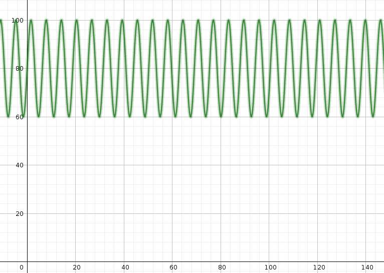
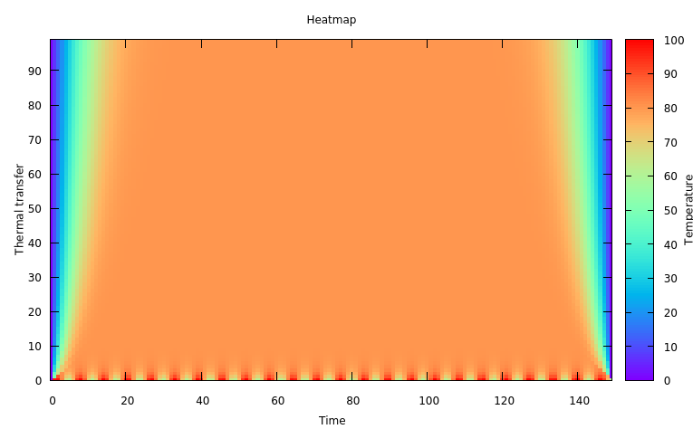

# Heat Equation Solver

Heat equation 1D solver using Bender-Schmidt finite difference method (FDM).  
Basicaly heat equation principle extends wave equation.  

## Equations
Heat equation can be solved using partial differential equation described as below

(∂u/∂t) = α²(∂²u/∂x²)

Considering 
* **u** as time space vector assimilated to U 2D matrix u(x,t)
* **t** as time
* **x** as energy
* **α²** as thermal coefficient

### Alpha square
α² is the thermal coefficient (W·m-²·K-¹) represented as below

**α² = k/pc**

Considering  

* **k** as thermal conductivity (W/(m·K))
* **p** as material density (Kg/m³)
* **c** specific heat capacity (kJ.kg-¹.K-¹)

## Requirements
* gcc
* gnuplot

## Use case

See example paramaters as below
* u(x) = 150
* u(t) = 100
* α² = 4 (thermal coefficient)
* u0 = 0 (initial boundary condition)
* un = 0 (terminal boundary condition)
* h = 1 (x stepsize along x-axis)
* k = 1/8 (t stepsize along y-axis)
* Energy e(x) = 20*sin(x)+80

*Energy convolution*

*Running build script './build_heateq.sh' will show representation as below*

*Matrix U datas can be found after build [here](./heateq.dat)*

## References
* [Heat equation](https://en.wikipedia.org/wiki/Heat_equation)
* [Solving heat equation using Bender-Schmidt method.](https://math.stackexchange.com/questions/2438511/solving-heat-equation-using-bender-schmidt-method)
* [Numerical explaination](https://www.youtube.com/watch?v=XM9SmieCRBU)
* [Heat transfer coefficient](https://en.wikipedia.org/wiki/Heat_transfer_coefficient)
* [Thermal conductivity](https://en.wikipedia.org/wiki/Thermal_conductivity)

## Appendices

### Materials properties

#### Specific heat capacities kJ.kg-¹.K-¹

|Material|HeatCapacity|
|--------|------------|
|Aluminium|0.897|
|Brass|0.377|
|Bronze|0.343|
|Cadmium|0.235|
|Constantan|0.410|
|Copper|0.384|
|Ethanol|2.940|
|Glass|0.670|
|flint|0.503|
|Pyrex|0.753|
|Gold|0.129|
|Graphite|0.838|
|Ice|2.100|
|Ironcast|0.420|
|Kerosene|2.100|
|Lead|0.130|
|Magnesia|0.930|
|Magnesium|1.030|
|Mercury|0.138|
|Molybdenum|0.272|
|Nickel|0.457|
|Oilmachine|1.676|
|Paraffin|2.100|
|Paraffinwax|2.140|
|Petroleum|2.140|
|Phosphorus|0.796|
|Platinum|0.133|
|Rubber|2.010|
|Salt|0.880|
|Sand|0.796|
|Seawater|3.940|
|Silica|0.800|
|Silicon|0.737|
|Silver|0.236|
|Tin|0.220|
|Titanium|0.523|
|Tungsten|0.142|
|Turpentine|1.760|
|Uranium|0.116|
|Vanadium|0.482|
|Water|4.196|
|Waterheavy|4.221|
|Wood|2.0|
|Zinc|0.388|

#### Densities Kg/m³

|Material|Density|
|--------|-------|
|Hydrogen|0.0898|
|Helium|0.179|
|Aerographite|0.2|
|Metallicmicrolattice|0.9|
|Aerogel|1.0|
|Air|1.2|
|Tungsten hexafluoride|12.4|
|Liquidhydrogen|70|
|Styrofoam|75|
|Cork|240|
|Pine|373|
|Lithium|535|
|Wood|700|
|Oak|710|
|Potassium|860|
|Ice|916.7|
|Cookingoil|910–930|
|Sodium|970|
|Water(fresh)|1|
|Water(salt)|1.03|
|Liquidoxygen|1.141|
|Nylon|1.15|
|Plastics|1.175|
|Glycerol|1.261|
|Tetrachloroethene|1.622|
|Sand|1.6|
|Magnesium|1.74|
|Beryllium|1.85|
|Concrete|2.4|
|Glass|2.5|
|Silicon|2.33|
|Quartzite|2.6|
|Granite|2.7|
|Gneiss|2.7|
|Aluminium|2.7|
|Limestone|2.75|
|Basalt|3|
|Diiodomethane|3.325|
|Diamond|3.5|
|Titanium|4.54|
|Selenium|4.8|
|Vanadium|6.1|
|Antimony|6.69|
|Zinc|7|
|Chromium|7.2|
|Tin|7.31|
|Manganese|7.325|
|Iron|7.87|
|Niobium|8.57|
|Brass|8.6|
|Cadmium|8.65|
|Cobalt|8.9|
|Nickel|8.9|
|Copper|8.94|
|Bismuth|9.75|
|Molybdenum|10.22|
|Silver|10.5|
|Lead|11.34|
|Thorium|11.7|
|Rhodium|12.41|
|Mercury|13.546|
|Tantalum|16.6|
|Uranium|18.8|
|Tungsten|19.3|
|Gold|19.32|
|Plutonium|19.84|
|Rhenium|21.02|
|Platinum|21.45|
|Iridium|22.42|
|Osmium|22.57|

#### Thermal conductivity W/(m·K)

|Material|Conductivity|
|--------|------------|
|Diamond|2000|
|Silver|429|
|Copper|398|
|Gold|315|
|Aluminum nitride|310|
|Silicon carbide|270|
|Aluminum|247|
|Tungsten|173|
|Graphite|168|
|Zinc|116|

[More...](https://en.wikipedia.org/wiki/List_of_thermal_conductivities)